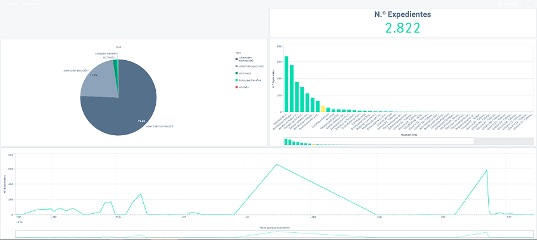

# 📊 Título del Recurso de Qlik
[Escribe aquí el título del recurso]

---

## 📝 Descripción
[Explica brevemente el propósito del recurso, cómo se utiliza y en qué contexto es útil.]

---

## 💻 Código
```qlik
// Inserta aquí el código de QlikScript, Set Analysis, o cualquier otra lógica relacionada
[Escribe tu código aquí]

Aquí tienes la plantilla en un solo bloque para que puedas copiar y pegar directamente:

🖼️ Imágenes



